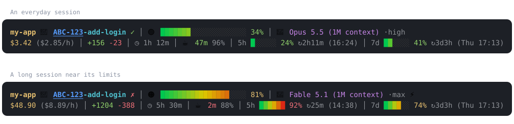

# claude-code-statusline

[](https://github.com/PetroOstapuk/claude-code-statusline/actions/workflows/ci.yml)

A fast two-line status line for [Claude Code](https://code.claude.com/docs/en/statusline).
It shows how full the context is, what the session costs, how long the prompt
cache stays warm, every usage limit with its reset time, the review state of
your pull request, and the issue key in the branch name as a clickable link.
It is one bash script and takes under 50 ms per update.



The repository also holds a [guide to where Claude Code's tokens go](guide/token-efficiency.md),
built on five weeks of real usage, and [a script that measures your own](tools/usage-report.py).

## Contents

- [What each part means](#what-each-part-means)
- [Requirements](#requirements)
- [Install](#install)
- [Configure](#configure)
- [Update and uninstall](#update-and-uninstall)
- [How it works](#how-it-works)
- [Security and privacy](#security-and-privacy)
- [Troubleshooting](#troubleshooting)
- [Where your tokens go](#where-your-tokens-go)
- [Development](#development)

## What each part means

```
my-app 🌱 ABC-123-add-login ✓ │ 🟢 ███████░░░░░░░░░░░░░ 34% │ 🚀 Opus 5.5 (1M context) ·high
$3.42 ($2.85/h) │ +156 -23 │ ◷ 1h 12m │ ☕ 47m 96% │ 5h █░░░░░ 24% ↻2h11m (16:24) │ 7d ██░░░░ 41% ↻3d3h (Thu 17:13)
```

| Part | Example | Meaning | Hidden when |
|---|---|---|---|
| Repository | `my-app` | name of the git repository you are in | outside a git repository |
| Branch | `🌱 ABC-123-add-login` | current branch; a detached HEAD shows its short commit id | outside a git repository |
| Issue key | `ABC-123` | blue and underlined; Cmd- or Ctrl-click opens the issue once [`ISSUE_URL`](#issue-links) is set | no key in the branch name |
| Review state | `✓` `✗` `◌` `·` | the open pull request is approved, has changes requested, is a draft, or is waiting for review | no open pull or merge request |
| Context | `🟢 ███░░ 34%` | how full the context window is. The light turns 🟡 at 50%, 🟠 at 70%, 🔴 at 90%, and is ⚪ before the first answer | — |
| Model | `🚀 Opus 5.5` | the model in use | — |
| Effort | `·high` | reasoning effort | the model has no effort setting |
| Fast mode | `⚡` | fast mode is on | fast mode is off |
| Thinking off | `💤` | extended thinking is switched off | thinking is on |
| Cost | `$3.42 ($2.85/h)` | Claude Code's cost estimate for the session at list prices, and the burn rate per hour | burn rate: during the first minute |
| Changes | `+156 -23` | lines added and removed in this session | — |
| Session time | `◷ 1h 12m` | how long the session has run | compact layout |
| Prompt cache | `☕ 47m 96%` | time until the cached context expires (green over 15 min, yellow 5–15, red under 5) and the share of input read from cache; `🧊 cold` once it has expired | before the first answer |
| Usage limits | `5h █░░░░░ 24% ↻2h11m (16:24)` | each usage window: share used, time until reset, reset time | not on a Pro or Max plan |

**About the cost.** It is the estimate Claude Code computes at list prices, not
a bill. On a subscription you spend plan usage, which the `5h` and `7d` windows
show. The [guide](guide/token-efficiency.md) explains what drives both.

**About the cache timer.** Every turn re-sends the whole conversation. While
the cache is warm that is cheap; once it expires, the next turn pays to write
everything again, which costs 20 to 80 times as much on current models. When
`☕` turns red and you are about to step away, send what you meant to send
first.

## Requirements

- **Claude Code.** The prompt-cache and spend-limit parts need version 2.1.251
  or later; on older versions those parts simply stay hidden.
- **bash 3.2 or later** (the version macOS ships works), **jq 1.6 or later**,
  and **git**. macOS: `brew install jq`. Debian or Ubuntu: `sudo apt-get install jq`.
- **A terminal with 24-bit colour and emoji.** Clickable issue keys need a
  terminal that supports OSC 8 hyperlinks, such as iTerm2, WezTerm, Kitty,
  Ghostty or the VS Code terminal. Inside tmux 3.4+, enable them with
  `set -as terminal-features ',*:hyperlinks'`.
- **macOS or Linux.** Windows through WSL should work but is untested.

The colours are chosen for dark terminal themes.

## Install

```sh
git clone https://github.com/PetroOstapuk/claude-code-statusline.git ~/.local/share/claude-code-statusline
~/.local/share/claude-code-statusline/install.sh
```

The installer asks for your issue tracker (optional, Enter skips) and then:

1. links `~/.claude/statusline.sh` to the script in your clone, after backing
   up any file already there;
2. points `statusLine` in `~/.claude/settings.json` at it, after backing that
   file up. Nothing else in it changes;
3. writes your choices to `~/.config/claude-statusline/config`, outside the
   repository.

Claude Code picks the status line up on its next update. The folder you run
Claude Code in has to be trusted, because a status line runs a command
([workspace trust](https://code.claude.com/docs/en/statusline)).

Without questions, for example in a dotfiles script:

```sh
./install.sh --issue-url https://acme.atlassian.net --strip-branch-prefix
```

| Option | What it does |
|---|---|
| `--issue-url URL` | make issue keys clickable; see [issue links](#issue-links) for what URL can be |
| `--no-issue-url` | turn issue links off |
| `--strip-branch-prefix` | show `ABC-123-login` for `abc_ABC-123-login` or `feature/ABC-123-login` |
| `--keep-branch-prefix` | show branch names in full (the default) |
| `--copy` | copy the script instead of linking to the clone |
| `--uninstall` | remove the status line and keep your settings |

<details>
<summary>Installing by hand</summary>

Put `statusline.sh` somewhere, make it executable, and add this to
`~/.claude/settings.json`:

```json
{
  "statusLine": {
    "type": "command",
    "command": "~/.claude/statusline.sh",
    "padding": 0,
    "refreshInterval": 10
  }
}
```

`refreshInterval` re-runs the script every 10 seconds, so that the countdowns
keep moving while Claude Code is idle.
</details>

## Configure

Settings live in `~/.config/claude-statusline/config`, one `KEY=value` per
line, with `#` for comments. The script reads the file on every update and
never executes it, so changes show up on the next update.

| Key | Default | Meaning |
|---|---|---|
| `ISSUE_URL` | empty | link template for issue keys, see below; empty means no links |
| `STRIP_BRANCH_PREFIX` | `0` | `1` hides whatever comes before the issue key, and a 2–5-letter handle such as `abc_` on branches without a key |
| `CTX_BAR_WIDTH` | `20` | blocks in the context bar, up to 60 |
| `LIMIT_BAR_WIDTH` | `6` | blocks in each usage-limit bar; `0` hides the bars, and they are dropped anyway with more than two windows |
| `COMPACT_BELOW` | `120` | on a terminal narrower than this: shorter bars, no burn rate, session time or cache hit rate, and the model name without "(1M context)"; `0` turns the compact layout off |
| `ICON_BRANCH` `ICON_MODEL` `ICON_CLOCK` `ICON_CACHE_WARM` `ICON_CACHE_COLD` `ICON_FAST` `ICON_THINK_OFF` | 🌱 🚀 ◷ ☕ 🧊 ⚡ 💤 | the icons. With a Nerd Font, `ICON_BRANCH=` gives the usual branch glyph |

### Issue links

`ISSUE_URL` is a link template in which `{key}` is replaced by the issue key.
Without `{key}`, the key is added as the last part of the path, which is what
Jira's `/browse/` expects.

| Tracker | `ISSUE_URL` |
|---|---|
| Jira Cloud | `https://acme.atlassian.net/browse/{key}` |
| Jira Server or Data Center | `https://jira.example.com/browse/{key}` |
| Linear | `https://linear.app/acme/issue/{key}` |
| YouTrack | `https://youtrack.example.com/issue/{key}` |

With `--issue-url` you can paste your Jira site or any issue link from it, and
the installer works out the template. It prints an example link to check.

An issue key is at least three capital letters, a dash and a number, such as
`ABC-123`. With only two letters, `RC-2` in `release/141-RC-2` would count as
a key too.

To change the tracker later, run `./install.sh --issue-url …` again or edit
the file.

## Update and uninstall

```sh
git -C ~/.local/share/claude-code-statusline pull
```

The link in `~/.claude` means the new version runs on the next update. Your
settings file is not part of the repository, so updates never touch it. After
a `--copy` install, run `./install.sh --copy` again instead.

`./install.sh --uninstall` removes the link and the `statusLine` entry. It
backs up `settings.json` first, keeps your settings file, and tells you where
your previous status line was backed up.

## How it works

Claude Code runs the script with a JSON description of the session on stdin
and shows what it prints. It runs when a session starts, after each answer,
after `/compact`, when a usage window resets or the cache expires, and every
`refreshInterval` seconds. Updates are debounced at 300 ms
([how status lines work](https://code.claude.com/docs/en/statusline)).

It stays fast by doing little per update:

- **One `jq` call** extracts and formats every field, including the reset
  times.
- **One `git` call** returns both the repository root and the branch.
- **`date`** is only needed on bash 3.2; bash 5 has the time built in.
- Everything else, the gradient bars included, uses bash builtins.

That is at most three processes per update, under 50 ms on an Apple Silicon
Mac, most of it spent in git. `./tools/bench.sh` measures it on your machine,
and `./tools/bench.sh 20 <command>` measures any other status line command the
same way.

Usage windows are read generically. Besides `5h` and `7d`, a spend limit set
by your organisation appears as `spend`, and any new window Claude Code adds
shows up without a code change. With more than two windows the mini-bars are
dropped so that the line stays readable.

## Security and privacy

A status line runs after every message and receives your session data,
including the path to the conversation transcript. Read any status line
script before you install it, this one included. This one:

- reads only its input and, if present, its settings file; runs only
  read-only git commands (`--no-optional-locks`, so it never takes git's
  index lock); uses no network; and writes nothing, apart from the opt-in
  debug dump below;
- never lets session data reach a `printf` format string, and strips control
  bytes from everything it prints, so a folder named with an escape sequence
  cannot clear your screen;
- parses its settings file line by line and never executes it, and accepts
  only a plain http(s) address as the issue link.

**Debugging.** `touch ~/.claude/.statusline-debug` and the next update writes
the raw input to `~/.claude/.statusline-last.json`. Delete both files
afterwards, because the dump contains your session data.

## Troubleshooting

- **Nothing appears.** Accept the workspace trust prompt for the folder.
  `claude --debug` logs the status line's exit code and errors. The
  `disableAllHooks` and `allowManagedHooksOnly` settings turn custom status
  lines off ([troubleshooting](https://code.claude.com/docs/en/statusline)).
- **Try it by hand:**
  `echo '{"workspace":{"current_dir":"'"$PWD"'"}}' | ~/.claude/statusline.sh`
- **Boxes instead of icons.** The font has no emoji; set the `ICON_*` keys to
  plain characters.
- **Issue keys don't open.** The terminal needs OSC 8 hyperlinks, and tmux
  needs them enabled (see [requirements](#requirements)).
- **No `5h` or `7d`.** Usage windows only exist for Claude Pro and Max plans,
  and appear after the first answer.
- **The line wraps.** Raise `COMPACT_BELOW` so that the compact layout starts
  at a wider terminal, or trim `CTX_BAR_WIDTH` and `LIMIT_BAR_WIDTH`.

## Where your tokens go

The [efficiency guide](guide/token-efficiency.md) takes five weeks of real,
anonymised Claude Code usage apart. Three findings from it:

- **55% of the spend was re-reading cached context.** What you type was about
  0%, so detailed prompts are never the problem.
- **The model generation matters more than the family.** Fable 5.1 and Opus
  5.5 read cached context at a quarter and 40% of their predecessors' price,
  and the same requests would have cost 42–44% less on them.
- **Long sessions and idle breaks are where money goes.** The ten biggest
  sessions took 58% of the spend. Rewriting the context after the cache
  expired took another 9%.

To measure your own usage, from the transcripts Claude Code keeps locally
(read-only, nothing leaves your machine):

```sh
python3 tools/usage-report.py
```

## Development

```sh
python3 -m unittest discover -s test                          # all tests, in a throwaway HOME
STATUSLINE_BASH=/bin/bash python3 -m unittest discover -s test  # with macOS's bash 3.2
python3 tools/render-demo.py                                  # regenerate assets/statusline.svg
./tools/bench.sh                                              # time an update
```

CI runs ShellCheck and the tests on Ubuntu (bash 5) and macOS (bash 3.2). One
test checks that every URL in the repository points at an allowed host, so
real tracker addresses stay in each user's settings file and examples use
`acme.atlassian.net` and `example.com`.

Other status lines worth a look, both listed in the Claude Code docs:
[ccstatusline](https://github.com/sirmalloc/ccstatusline), with widgets, themes
and an interactive configurator, and
[starship-claude](https://github.com/martinemde/starship-claude), for
[Starship](https://starship.rs) users.

## License

[MIT](LICENSE)
